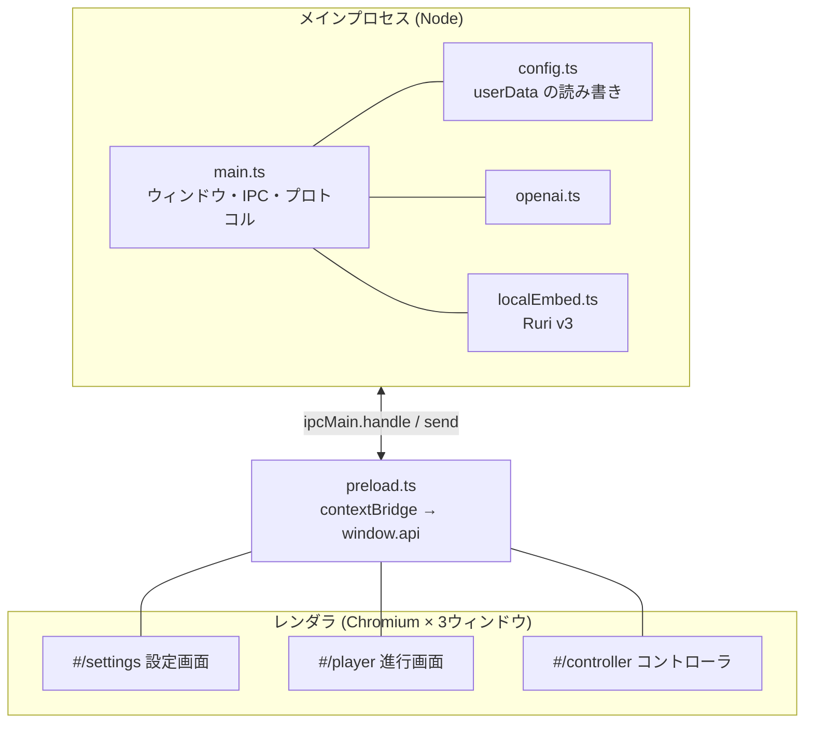

# アーキテクチャ

## プロセス構成

Electron の標準構成（メイン / プリロード / レンダラ）です。`nodeIntegration` は使わず、
レンダラから外に出る手段は **preload が公開する `window.api` だけ**に絞ってあります。



3 つの画面は**同じ JS バンドル**です。`src/main.tsx` が `window.location.hash` を見て
`SettingsApp` / `PlayerApp` / `ControllerApp` のどれかを描くだけで、ビルド成果物は 1 つです。

```ts
// src/main.tsx
if (route.startsWith('/player')) return <PlayerApp scenarioId={params.get('scenario')} />;
if (route.startsWith('/controller')) return <ControllerApp />;
return <SettingsApp />;
```

## ウィンドウのライフサイクル

| ウィンドウ | いつ開く | いつ閉じる |
| --- | --- | --- |
| 設定画面 | アプリ起動時（`app.whenReady`） | ユーザーが閉じたとき |
| 進行画面 | 設定画面の「▶ このシナリオで開始」→ `player:open` | Esc、または「展示を終了」 |
| コントローラ | 進行画面を**外部モニターに出したときだけ**自動で | 進行画面と対で閉じる |

進行画面とコントローラは**対**です。片方を閉じるともう片方も閉じます
（[main.ts](../electron/main.ts) の `createPlayerWindow` / `createControllerWindow` の `closed` ハンドラ）。
モニター1台構成ではコントローラは開きません。この場合だけ進行画面に ◀ ▶ ボタンが出ます
（コントローラがあるときは来場者に見せる必要がないので隠します。`controller:presence` で判定）。

外部モニターの選び方は「プライマリではない最初のディスプレイ」という単純な規則です。
全画面化は `ready-to-show` を待ってから `setBounds` → `setFullScreen(true)` の順で行います。
順序を逆にすると主画面のほうが全画面になります。

## データの流れ

### 設定

```
設定画面 ──500ms デバウンス──▶ config:save ──▶ config.json
                                    │
                                    └─▶ 全ウィンドウへ config:changed をブロードキャスト
```

設定画面は [useConfig.ts](../src/settings/useConfig.ts) が自動保存します（明示的な保存ボタンはありません）。
進行画面とコントローラは `api.config.onChanged` を購読しているので、展示中に設定を変えても即座に反映されます。
コントローラから開始時刻を書き換える機能（[NextStartPanel.tsx](../src/controller/NextStartPanel.tsx)）も、
専用の経路ではなく **config を保存し直す**ことで実現しています。

### 再生状態

```
進行画面 ──playback:state──▶ main（lastPlaybackState に保持）──▶ コントローラ
コントローラ ──playback:command──▶ main ──▶ 進行画面
```

**状態を持っているのは進行画面だけ**です。コントローラは `PlaybackState` を受け取って描くだけで、
自分では何も覚えません。メインプロセスが最後の状態を `lastPlaybackState` に持っているのは、
コントローラが後から開いても現在値を出せるようにするためです（`playback:current` で取得）。

進行画面は状態を JSON 化して前回と比較し、**変化したときだけ** publish します。
経過時間の再描画などで IPC が溢れないようにするためです。

## キー入力が二系統ある理由

同じキーが「進行画面がアクティブなとき」と「コントローラがアクティブなとき」の両方で効く必要があります。
実装は次の 3 層に分かれています。

| 層 | 場所 | 担当 |
| --- | --- | --- |
| メインプロセス | `attachControllerKeys`（[main.ts](../electron/main.ts)） | **コントローラ**の N/P/S/R/F/Esc/←/→ |
| 進行画面の window | `PlayerApp` の `keydown` | 進行画面の N/P/S/R/F/Esc |
| コンテンツ内部 | `useStepKeys`（[useAudio.ts](../src/player/useAudio.ts)） | ←/→/Space（スライドのページ送りなど） |

コントローラ側だけ `before-input-event`（レンダラより先に発火するメインプロセス側のフック）を使っています。
理由は 2 つです。

1. レンダラ内のどこにフォーカスがあっても確実に効かせるため
2. **IME が有効でも効かせるため**。日本語入力中は通常の `keydown` が拾えません

その代償として、入力欄に打ち込んでいる間もキーを横取りしてしまいます。そこで
コントローラのレンダラが `focusin` / `focusout` で `controller:typing` を送り、
**打ち込み中は Esc も含めて一切横取りしない**ようにしています（誤って展示を終了しないため）。

Space だけはメイン側で扱いません。ボタンにフォーカスがあるとクリックと二重に反応するためで、
コントローラのレンダラ側で処理しています。

コントローラで押した ←/→ は `playback:command` の `advance` / `back` として進行画面に届き、
進行画面が `KeyboardEvent` を合成して `window` に流します。これで
コンテンツ側の `useStepKeys` が、自分で押されたのと同じように反応します。

```ts
// PlayerApp.tsx — コントローラからの advance をコンテンツ内部のキー処理へ橋渡しする
window.dispatchEvent(new KeyboardEvent('keydown', { key: 'ArrowRight' }));
```

## ファイル参照とカスタムプロトコル

レンダラは `file://` を直接読めないので、2 つのプロトコルを登録しています。

| スキーム | 形式 | 用途 |
| --- | --- | --- |
| `oc://` | `oc://assets/<ファイル名>` | アプリが `userData/assets` に取り込んだ動画・PDF・画像・音声 |
| `ocfile://` | `ocfile://local/<絶対パスをURIエンコード>` | Marp の .md とその画像を**元の場所のまま**参照する |

`oc://` は `path.basename` を通したうえで `assetsDir()` 配下かを確認し、外に出られないようにしています。
`ocfile://` は絶対パスかつ存在することだけ確認して読みます（ユーザーが自分で選んだファイルのため）。

## ビルドパイプライン

メインプロセスとレンダラでバンドラが違います。

```
electron/main.ts, preload.ts ──esbuild──▶ dist/main/{main,preload}.js   (cjs, node20)
src/**                       ──vite────▶ dist/renderer/                (chrome120)
```

- ネイティブバイナリを含む `electron`・`@huggingface/transformers`・`onnxruntime-node`・`sharp` は
  **バンドルせず** `node_modules` から読ませます（[scripts/build.mjs](../scripts/build.mjs) の `external`）
- 開発時は [scripts/dev.mjs](../scripts/dev.mjs) が vite の dev server を立て、esbuild の watch が
  メイン側を再ビルドするたびに Electron を再起動します。`VITE_DEV_SERVER_URL` の有無で
  `rendererUrl()` が dev サーバか `file://` かを切り替えます
- 配布は electron-builder。`dist/` はアプリのビルド出力なので、成果物は `release/` に出します

詳細は [development.md](development.md) を見てください。
